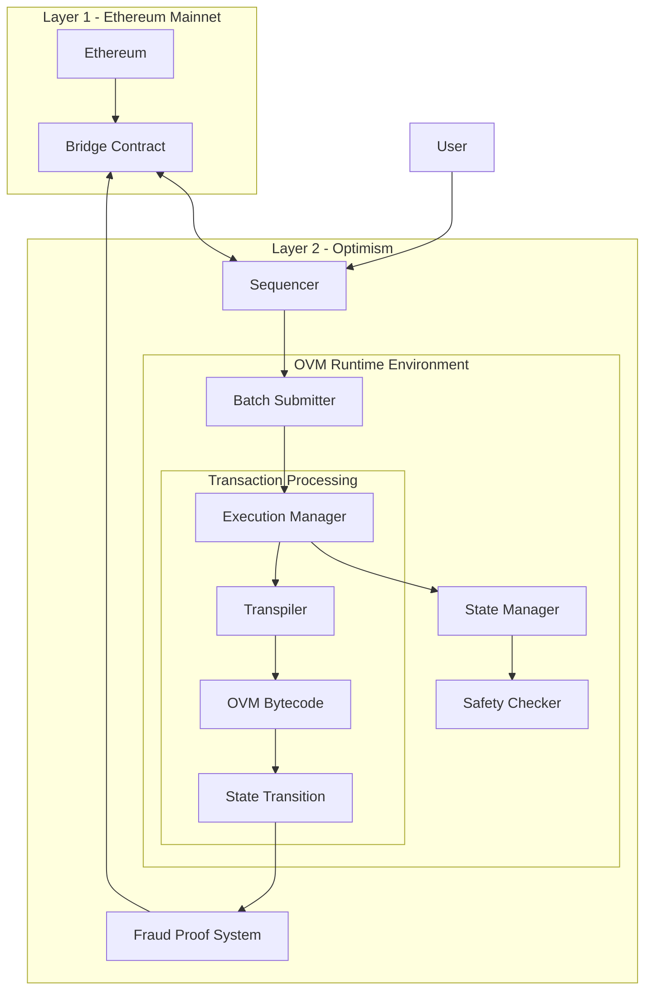

# Optimism_VM_Architecture

The Optimistic Virtual Machine (OVM) is a virtual machine designed for Layer 2 scaling solutions, specifically for Optimism. It provides EVM compatibility while enabling high throughput and low-cost transactions.



## Core Components
- Execution Manager
  - Manages transaction execution
  - Provides virtualized EVM context
  - Handles state transitions
- State Manager
  - Maintains L2 state
  - Manages state updates
  - Ensures state consistency
- Safety Checker
  - Validates operations
  - Ensures security constraints
  - Prevents unauthorized state access
- Transpiler
  - Converts EVM bytecode to OVM bytecode
  - Ensures compatibility
  - Optimizes execution
## Communication with L1
- Bridge Contract
    ```solidity
    interface IL1Bridge {
        function depositETH() external payable;
        function withdrawETH(uint256 amount) external;
        function finalizeWithdrawal(bytes proof) external;
    }
    ```
- Batch Submission
  - Transactions are batched for efficiency
  - Submitted periodically to L1
  - Reduces gas costs
- Security Model
  - Fraud Proofs
    - State roots published to L1
    - Challenge period (7 days)
    - Interactive fraud proof if challenged
    - Automatic resolution
  - Security Features
    - EVM compatibility
    - L1 security inheritance
    - Challenge-response mechanism
