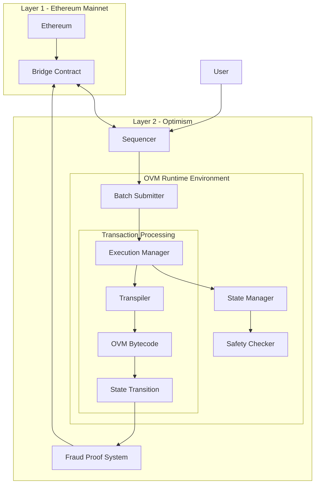

# Optimism_VM_Architecture

The Optimistic Virtual Machine (OVM) is a virtual machine designed for Layer 2 scaling solutions, specifically for Optimism. It provides EVM compatibility while enabling high throughput and low-cost transactions.

